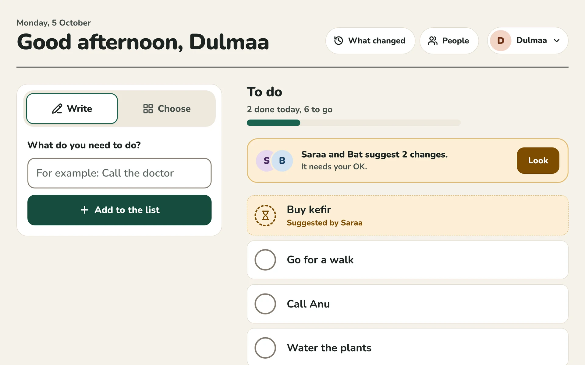
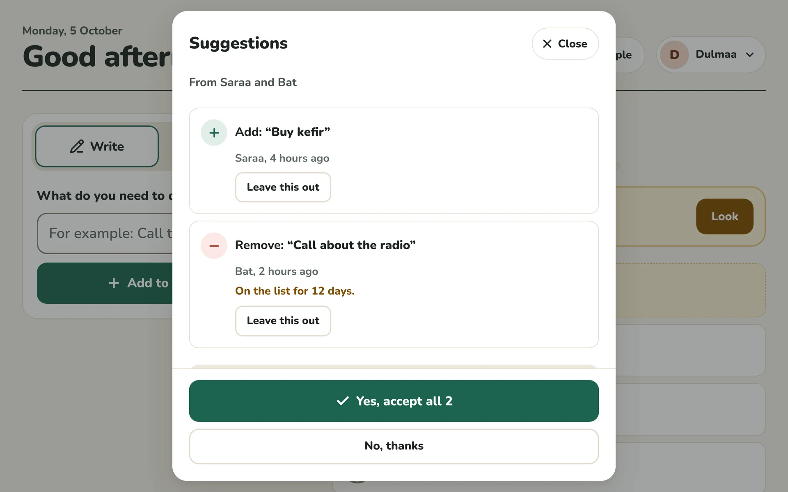
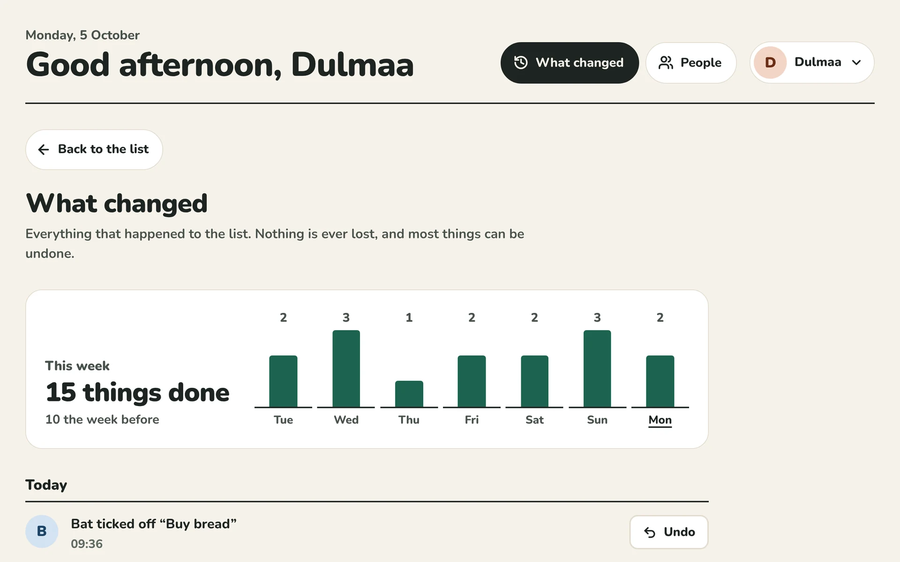
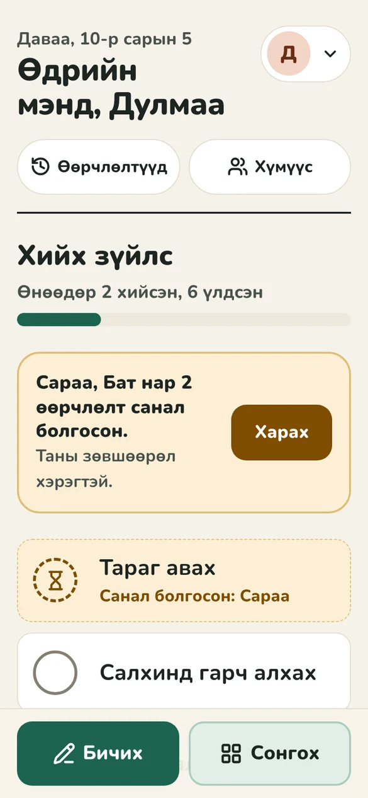

# Control · Todo

The first mini project of **Control**, an admin system that works like GitHub for everyday data: roles, suggestions, approvals, a full history and undo. The test for every decision: *an 80-year-old must be able to use it with very few, simple actions.* All the complexity sits underneath.



## What it does

**Two side options**

- **Write**: type what needs doing and press one big button.
- **Choose**: tap a ready-made tile (pills, water, call the family…). Tiles never move. Things you write by hand more than once get their own tiles.

**The list**

- Tap the circle to tick something off. Every action shows a message with **Undo**, which waits ten seconds and longer if you hover over it.
- Things done before today are tidied away by themselves. They stay in the history.

**Suggestions (pull requests for data)**

- People who may only *suggest* see their changes wait for an OK, right inside the list, with **Take back**.
- Changes from different people collect in one suggestion, so two helpers with different rights can prepare one change together. Someone who can approve says **Yes** or **No**, or leaves single parts out.
- The review shows what accepting will do ("after this, 6 things to do") and why it might make sense ("on the list for 12 days").

**What changed (version history)**

- Everything that ever happened, in plain sentences, grouped by day.
- **Undo** anything the rules allow, or **go back to any moment**. Both are saved as new changes, so they can be undone too. Nothing is ever lost.
- This week's progress as a small chart.

**People (roles and permissions)**

- Who can do what, written as sentences instead of a permission table.
- A ladder of five roles (*Can look → Can suggest → Can change → Can approve → Owner*), plus **Fine-tune** (No / Suggest / Yes for each action).
- A hint drawn from the history: *"Saraa's last 7 suggestions were all accepted. Let Saraa do this directly."*
- **Together**: tap a few people and read what they can do as a team, and who must approve the rest.

**For everyone**

- English and Mongolian. Three text sizes. Light and dark, following the device.
- Large buttons (about 58 px), contrast checked to AAA for text, keyboard and screen-reader friendly. axe finds no WCAG 2.1 AA issues on any screen.

| Review a suggestion | What changed | Phone · Mongolian · dark |
|---|---|---|
|  |  |  |

## Try it

You need [Node.js](https://nodejs.org) **22.12 or newer** (24 LTS recommended). Check with `node -v`.

```bash
npm install
npm run dev
```

<details>
<summary>Trouble installing?</summary>

- **"Control needs Node.js 22.12 or newer"**: install the current LTS. On Windows, run `winget install OpenJS.NodeJS.LTS` (or download it from nodejs.org), open a new terminal, and check `node -v`.
- **"Cannot find native binding"**: the folder was installed with an older Node, and npm skipped Vite's native build. After upgrading Node, delete `node_modules` (in PowerShell: `Remove-Item -Recurse -Force node_modules`) and run `npm install` again. Keep `package-lock.json`: it already lists the Windows build.

</details>

Open <http://localhost:5173> and tap a name. The app starts with a two-week sample history for one household:

| Person | Who | Can |
|---|---|---|
| **Dulmaa** | the owner, 80 | everything, and decides who can do what |
| **Anu** | her daughter | change things and approve suggestions |
| **Bat** | her grandson | add and tick off; may only *suggest* changing words or removing |
| **Saraa** | her carer | only suggest (every suggestion so far was accepted) |
| **Bold** | a neighbour | only look |

**Tip:** open two tabs, one as Dulmaa and one as Saraa. When Saraa suggests something, it appears in Dulmaa's tab straight away.

*Settings → Start over with the sample list* resets everything.

## Scripts

| Command | What it does |
|---|---|
| `npm run dev` | Development server with hot reload |
| `npm test` | Unit and property tests (Vitest) |
| `npm run typecheck` | TypeScript, strict |
| `npm run build` | Typecheck, then production build into `dist/` |
| `npm run build:single` | One self-contained `dist-single/index.html` (fonts included) to share or open from disk |
| `npm run e2e` | Browser tests and accessibility audit (Playwright + axe). Run `npx playwright install chromium` once first |
| `npm run check` | Typecheck, tests and build: what CI runs |

## How it is built

```
src/
  core/    the domain, pure TypeScript, no React. Permissions, changes, history,
           suggestions, policy, insights. Every rule lives here and is tested.
  store/   storage port, a localStorage adapter (multi-tab, crash-proof), the
           versioned stored format, and the sample history
  i18n/    English and Mongolian, type-checked to stay complete
  app/     the React interface: thin, it only sends commands and shows outcomes
e2e/       browser tests and the accessibility audit
docs/      plan, architecture, the algebra, design rules
```

The interface never changes data. It sends a **command** (`add`, `check`, `undo`, `accept`…) to one function, `dispatch`, which checks who is asking and returns one of four outcomes: *published*, *suggested*, *updated* or *refused, with a reason*. Data is never overwritten. The state is replayed from an append-only log of versions, which is where the history, undo and the audit trail come from.

The permission model and the change history are built on small algebraic structures, kept honest by property tests:

- **Permissions** form a lattice: combining roles is a join (associative, commutative, idempotent, with "can look" as identity). A team's joint ability is the join of its members.
- **Changes** form a groupoid: every change has an exact inverse, changes compose, and undo is just the inverse. Changes to different things commute, which gives a normal form and safe undo of old changes.

Read more:

- [docs/PLAN.md](docs/PLAN.md): the product plan, what M1–M3 delivered, what comes next
- [docs/ARCHITECTURE.md](docs/ARCHITECTURE.md): layers, the life of a tap, storage, decisions
- [docs/ALGEBRA.md](docs/ALGEBRA.md): the lattice and the groupoid, with the laws and where each is tested
- [docs/DESIGN.md](docs/DESIGN.md): designing for an 80-year-old, the soft Swiss visual system, contrast numbers

## Tests

- **97 unit and property tests.** The algebraic laws are checked on hundreds of random histories each, along with every workflow rule (four-eyes approval, the last owner, undo conflicts, rebasing suggestions) and storage edge cases (unreadable data, newer versions, failed saves, two tabs).
- **An independent review** went looking for ways around the rules and for data loss. It found ten bugs, all fixed, and each now has a regression test (`src/core/__tests__/regressions.test.ts`).
- **37 browser tests** on desktop and phone: Write, Choose, ticking (a double tap ticks once), Undo → Redo → Undo, suggestions, undo from history, roles, language, text size, keyboard-only use, two tabs as two people, and an **axe WCAG 2.1 AA audit of every screen** in light and dark.

## Status

This is a working local prototype: data stays in the browser, and "who is using it" is a simple picker standing in for sign-in. The core is pure and has no browser dependencies, so the same `dispatch` can run on a server. See *Next* in [docs/PLAN.md](docs/PLAN.md).
