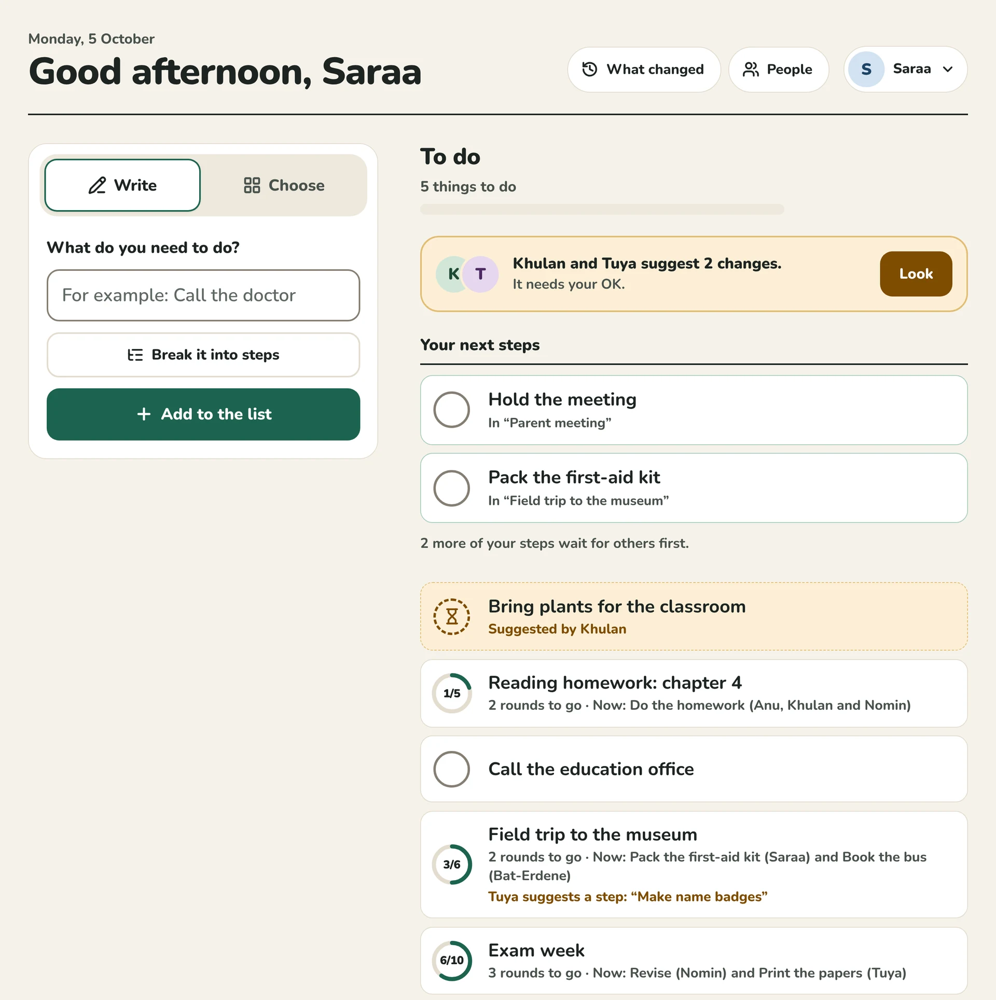
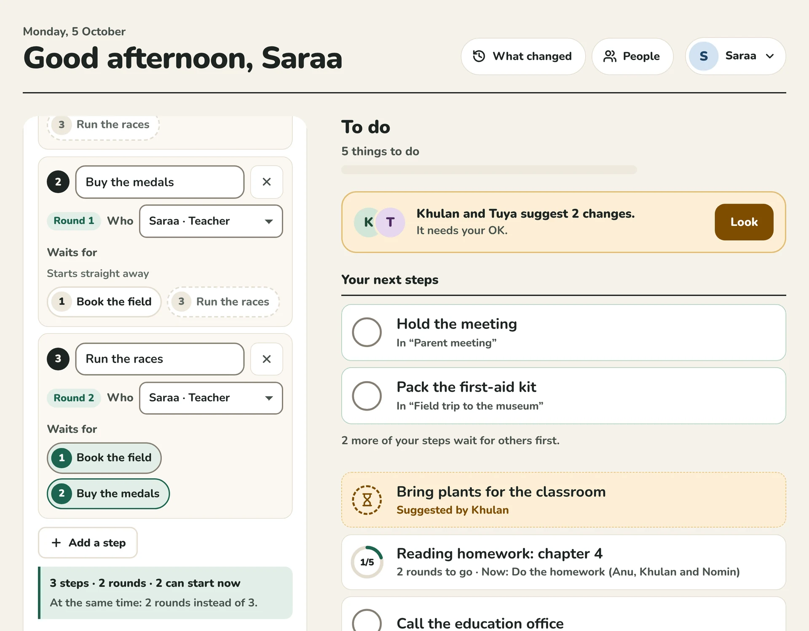
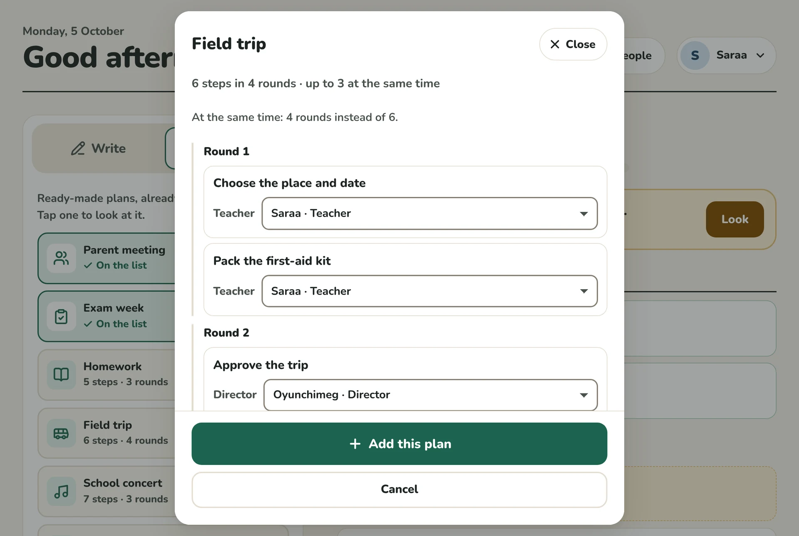
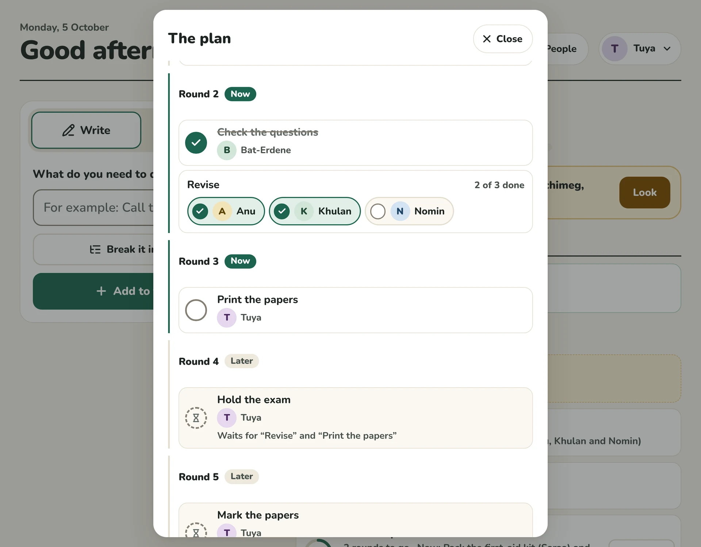
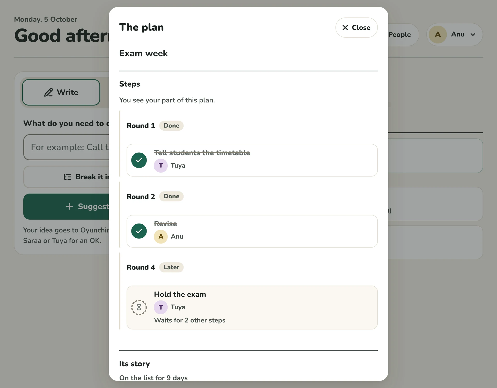
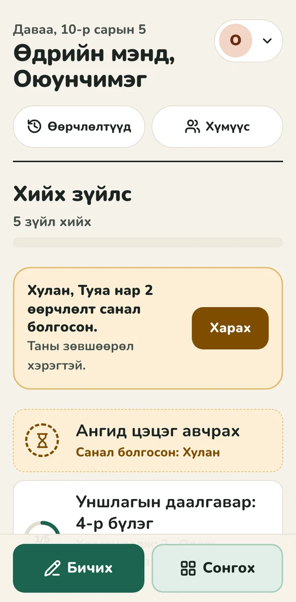
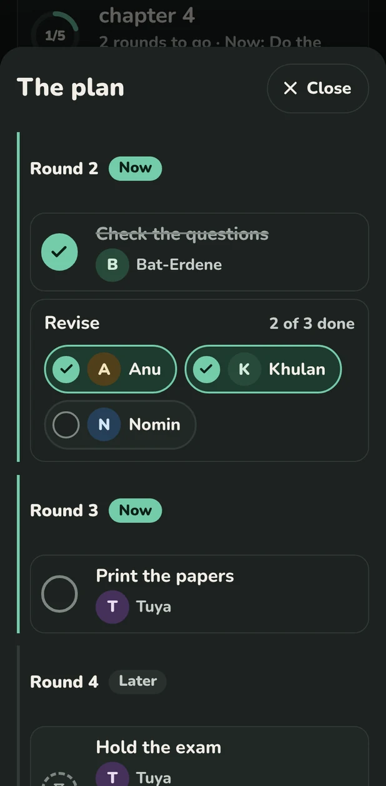

# Control · Todo

The first mini project of **Control**, an admin system that works like GitHub for everyday data: roles, suggestions, approvals, a full history and undo. The test for every decision: *an 80-year-old must be able to use it with very few, simple actions.* All the complexity sits underneath.

It comes with two standards. The **school** (K-12) is the default: roles from director to student, and tasks that can be broken into steps from the start, so work runs side by side instead of waiting in line. The **home** standard is the original household list.



## What it does

### Two side options

- **Write**: type what needs doing and press one big button. At school, **Break it into steps** turns it into a plan.
- **Choose**: at school, ready-made plans; at home, tiles (pills, water, call the family…) that never move.

### Breaking a task down (school)

- Add steps, say who does each one, and tap what it waits for. Steps that wait for nothing can all start straight away.
- The app shows the plan's shape as you go: *"3 steps · 2 rounds · 2 can start now. At the same time: 2 rounds instead of 3."* It says when a wait makes the whole plan longer (*"Waiting for it adds a round"*), and a wait that would go round in a circle can't be chosen.
- **Six ready-made plans** (parent meeting, exam week, homework, field trip, school concert, lesson plan check), already broken down with as few waits as the work allows. Each step asks for a role and the app fills in people. A step for *every student* becomes one step per student, all done at the same time. You see who does what before adding it.

### Doing the steps

- **Your next steps** sits at the top of the list: only what you can do right now, across every plan, one tap to tick.
- Each plan in the list shows a ring (done of total), how many rounds are left, and who can act now.
- The plan itself is shown as **rounds**: Done, Now, Later. More than one round can be *Now*, because work runs ahead wherever it can. A step that is still waiting shows an hourglass, says what it waits for, and can't be ticked yet.
- A task with steps is done when its last step is done.

### Strict control

- **Roles** (school): *Parent < Student < Teacher < Manager < Director*. Teachers run their own plans and suggest changes to anyone else's. Students tick their own steps and suggest ideas for a teacher's OK. Parents tick the steps given to them, like signing a trip slip.
- **Who sees what**: people below teacher see only their part, which is their own steps and the ones right next to them. Everything else is just a number: *"Waits for “Revise” and 2 other steps"*. The same rule holds for the list, the history, the week chart and even the reasons for a refusal.
- **Plan rules hold on every version**: no circles, a step only waits for steps of its own plan, and a done step never waits for an undone one. A change that would break them is refused, and a suggestion that would break them is marked out of date.
- A change made from an old screen (words, who does a step, what it waits for, a role) is refused rather than silently overwriting what someone else did meanwhile.

### Suggestions (pull requests for data)

- People who may only *suggest* see their changes wait for an OK, right inside the list, with **Take back**.
- Changes from different people collect in one suggestion, so people with different rights can prepare one change together. Someone who can approve says **Yes** or **No**, or leaves parts out. Nobody approves their own change: four eyes are judged on what accepting would actually do.
- The review shows what accepting will do and why it might make sense.

### What changed (version history)

- Everything that ever happened, in plain sentences, grouped by day. *"Tuya added “Exam week” with 10 steps."*
- **Undo** anything the rules allow, or **go back to any moment**. Both are saved as new changes, so they can be undone too. Nothing is ever lost.
- This week's progress as a small chart.

### People (roles and permissions)

- Who can do what, written as sentences instead of a permission table, for their own things and for anyone's.
- **Fine-tune** each action (No / Suggest / Yes), separately for *their own* and *anyone's*.
- A hint drawn from the history: *"Anu's last 5 suggestions were all accepted. Let Anu do this directly."*
- **Together**: tap a few people and read what they can do as a team, and who must approve the rest.

### For everyone

- English and Mongolian. Three text sizes. Light and dark, following the device.
- Large buttons (about 58 px), contrast checked to AAA for text, keyboard and screen-reader friendly. axe finds no WCAG 2.1 AA issues on any screen.

| Write, broken into steps | A ready-made plan | The plan as rounds |
|---|---|---|
|  |  |  |

| A student sees her part | Phone · Mongolian | Phone · dark |
|---|---|---|
|  |  |  |

## Try it

You need [Node.js](https://nodejs.org) **22.12 or newer** (24 LTS recommended). Check with `node -v`.

```bash
npm install
npm run dev
```

<details>
<summary>Trouble installing?</summary>

- **"Control needs Node.js 22.12 or newer"**: install the current LTS. On Windows, run `winget install OpenJS.NodeJS.LTS` (or download it from nodejs.org), open a new terminal, and check `node -v`.
- **"Cannot find native binding"**: the folder was installed with an older Node, and npm skipped Vite's native build. After upgrading Node, delete `node_modules` (in PowerShell: `Remove-Item -Recurse -Force node_modules`) and run `npm install` again. Keep `package-lock.json`: it already lists the Windows build.

</details>

Open <http://localhost:5173> and tap a name. The app starts with two weeks of school life: homework done by every student at once, a parent meeting, an exam week half done, a field trip being planned.

| Person | Role | Can |
|---|---|---|
| **Oyunchimeg** | director | everything, and decides who can do what |
| **Bat-Erdene** | manager | change anything and approve suggestions |
| **Saraa**, **Tuya** | teachers | run their own plans, suggest changes to others', approve suggestions |
| **Anu**, **Khulan**, **Nomin** | students | tick their own steps, suggest ideas; they see only their part |
| **Dorj** | a parent | tick the steps given to him |

**Tip:** open two tabs, one as Saraa and one as Anu. Open *Exam week* in both: Saraa sees the whole plan, Anu sees her part.

**The household example:** open <http://localhost:5173/?example=home> on a fresh start, or use *Settings → Start over with an example → Home*.

| Person | Who | Can |
|---|---|---|
| **Dulmaa** | the owner, 80 | everything, and decides who can do what |
| **Anu** | her daughter | change things and approve suggestions |
| **Bat** | her grandson | add and tick off; may only *suggest* changing words or removing |
| **Saraa** | her carer | only suggest (every suggestion so far was accepted) |
| **Bold** | a neighbour | only look |

| Home | Review a suggestion | Phone · Mongolian |
|---|---|---|
|  |  |  |

## Deploying

It builds to a static site, so it runs on Vercel (or any static host) as is. `vercel.json` is included: the build runs the typecheck and the tests first, and the site is served with strict security headers (the browser tests pass behind them).

One thing to know before a real school uses it: **data stays in each browser.** Every phone or computer keeps its own list, and the name picker is not a sign-in. For a school where many people share one list from their own devices, the next step is a small server and real sign-in (see *Next* in [docs/PLAN.md](docs/PLAN.md)). The core is ready for that.

## Scripts

| Command | What it does |
|---|---|
| `npm run dev` | Development server with hot reload |
| `npm test` | Unit and property tests (Vitest) |
| `npm run typecheck` | TypeScript, strict |
| `npm run build` | Typecheck, then production build into `dist/` |
| `npm run build:single` | One self-contained `dist-single/index.html` (fonts included) to share or open from disk |
| `npm run e2e` | Browser tests and accessibility audit (Playwright + axe). Run `npx playwright install chromium` once first |
| `npm run check` | Typecheck, tests and build: what CI and Vercel run |

## How it is built

```
src/
  core/    the domain, pure TypeScript, no React. Permissions, changes, history,
           suggestions, policy, plans (partial orders), insights.
           Every rule lives here and is tested.
  store/   storage port, a localStorage adapter (multi-tab, crash-proof), the
           versioned stored format with migration, and both sample histories
  i18n/    English and Mongolian, type-checked to stay complete
  app/     the React interface: thin, it only sends commands and shows outcomes
e2e/       browser tests and the accessibility audit
docs/      plan, architecture, the algebra, design rules
```

The interface never changes data. It sends a **command** (`add`, `addStep`, `checkStep`, `undo`, `accept`…) to one function, `dispatch`, which checks who is asking and returns one of four outcomes: *published*, *suggested*, *updated* or *refused, with a reason*. Data is never overwritten. The state is replayed from an append-only log of versions, which is where the history, undo and the audit trail come from.

The rules are built on small mathematical structures, used for real and kept honest by property tests:

- **Permissions** form a distributive lattice of down-sets. Combining roles is a join (associative, commutative, idempotent, with "nothing" as identity), and a team's joint ability is the join of its members. Rights come in two scopes, *own* and *anyone's*, and acting on anyone's things implies seeing them. Each standard's roles form a chain.
- **Plans** are partial orders. The rounds are the levels of the order; their number is the longest chain of waits (Mirsky), so no schedule is shorter. How many steps can run at once is the width (Dilworth, computed with a matching). Done steps always form a down-set.
- **Changes** form a groupoid: every change has an exact inverse, changes compose, and undo is just the inverse. Changes to different things commute, which gives a normal form and safe undo of old changes. Plan rules are checked per version, never per change, so that stays true.

Read more:

- [docs/PLAN.md](docs/PLAN.md): the product plan, what M1–M4 delivered, what comes next
- [docs/ARCHITECTURE.md](docs/ARCHITECTURE.md): layers, the life of a tap, plans, who sees what, storage, decisions
- [docs/ALGEBRA.md](docs/ALGEBRA.md): the lattice, the partial orders and the groupoid, with the laws and where each is tested
- [docs/DESIGN.md](docs/DESIGN.md): designing for an 80-year-old, the soft Swiss visual system, contrast numbers

## Tests

- **148 unit and property tests.** The algebraic laws are checked on hundreds of random cases each: the lattice, the partial-order facts (rounds, longest chain, width, Foata normal form, removing a step), and the groupoid. A fuzz test runs random school histories (10 to 60 actions by people with every role) and checks after every step that no plan breaks its rules.
- **Two independent reviews** went looking for ways around the rules, for data loss and for leaks. The first found ten bugs in the household version; the second found ten in plans and school roles (mostly a student seeing a little too much) plus a gap in four eyes. All are fixed, and each has a regression test (`src/core/__tests__/regressions.test.ts`, `school-regressions.test.ts`).
- **29 browser tests**, each on desktop and phone: breaking a task down, ready-made plans, rounds, a student's part, next steps, Write, Choose, ticking (a double tap ticks once), Undo → Redo → Undo, suggestions, undo from history, roles, language, text size, keyboard-only use, two tabs as two people, and an **axe WCAG 2.1 AA audit of every screen** in light and dark.

## Status

This is a working local prototype: data stays in the browser, and "who is using it" is a simple picker standing in for sign-in. The core is pure and has no browser dependencies, so the same `dispatch` can run on a server. See *Next* in [docs/PLAN.md](docs/PLAN.md).
